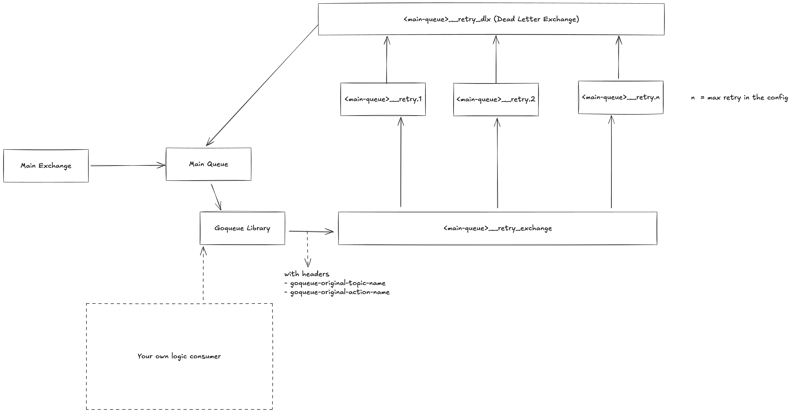
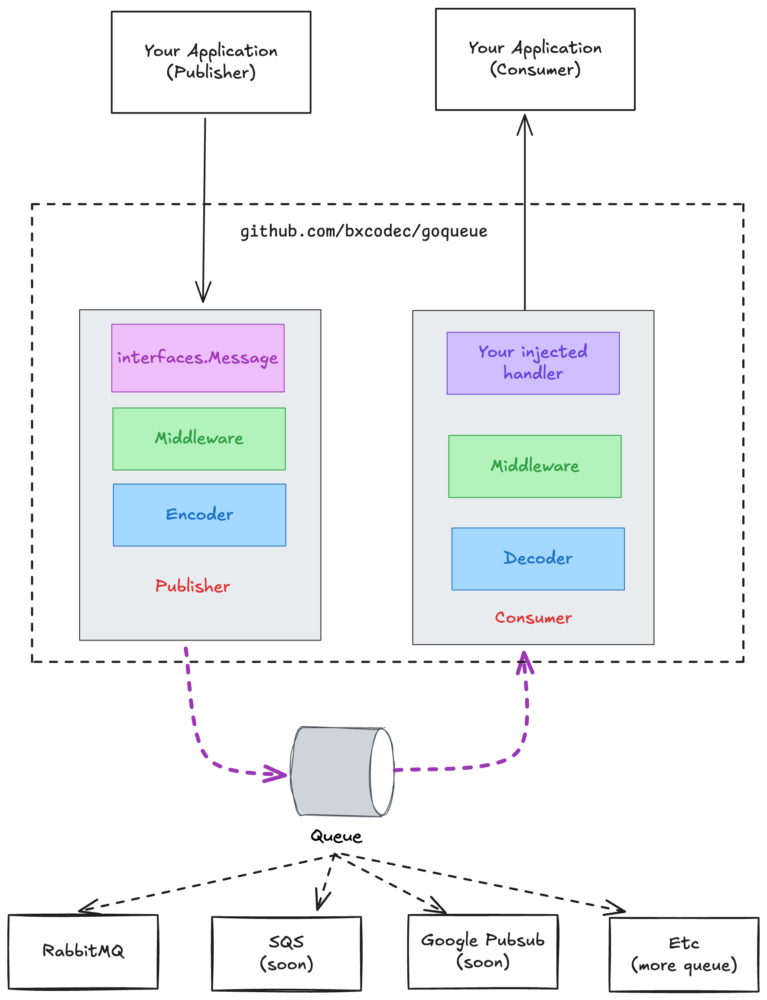

# 🚀 GoQueue - Universal Go Message Queue Library

[](https://pkg.go.dev/github.com/bxcodec/goqueue)
[](https://goreportcard.com/report/github.com/bxcodec/goqueue)
[](https://opensource.org/licenses/MIT)
[](https://github.com/bxcodec/goqueue/stargazers)

**One library to rule them all** - A powerful, extensible, and developer-friendly Go wrapper that simplifies message queue operations across multiple platforms. Build robust, scalable applications with consistent queue operations, regardless of your underlying message broker.

## ✨ Why GoQueue?

🎯 **Universal Interface** - Write once, run anywhere. Switch between queue providers without changing your code  
⚡ **Production Ready** - Built-in retry mechanisms, dead letter queues, and error handling  
🛡️ **Type Safe** - Strongly typed interfaces with comprehensive error handling  
🔧 **Extensible** - Plugin architecture for custom middleware and queue providers  
📊 **Observable** - Built-in logging and middleware support for monitoring  
🚀 **Developer Experience** - Intuitive API design with sensible defaults

---

## 📋 Table of Contents

- [🚀 Quick Start](#-quick-start)
- [💫 Features](#-features)
- [🛠️ Installation](#️-installation)
- [📖 Basic Usage](#-basic-usage)
- [🔧 Advanced Features](#-advanced-features)
- [🎮 Examples](#-examples)
- [🏗️ Architecture](#️-architecture)
- [📚 Documentation](#-documentation)
- [🤝 Contributing](#-contributing)
- [📄 License](#-license)

---

## 🚀 Quick Start

Get up and running in less than 5 minutes:

```bash
go get -u github.com/bxcodec/goqueue
```

```go
package main

import (
	"context"
    "log"

	"github.com/bxcodec/goqueue"
	"github.com/bxcodec/goqueue/consumer"
    "github.com/bxcodec/goqueue/publisher"
	"github.com/bxcodec/goqueue/interfaces"
)

func main() {

	// Create queue service
    queueSvc := goqueue.NewQueueService(
        options.WithConsumer(myConsumer),
        options.WithPublisher(myPublisher),
        options.WithMessageHandler(handleMessage),
    )

    // Publish a message
    queueSvc.Publish(context.Background(), interfaces.Message{
        Data:   map[string]interface{}{"hello": "world"},
        Action: "user.created",
        Topic:  "users",
    })

    // Start consuming
    queueSvc.Start(context.Background())
}

func handleMessage(ctx context.Context, m interfaces.InboundMessage) error {
    log.Printf("Received: %v", m.Data)
    return m.Ack(ctx) // Acknowledge successful processing
}
```

---

## 💫 Features

### 🎯 **Core Features**

- **Multi-Provider Support**: Currently supports RabbitMQ (more coming soon!)
- **Unified API**: Consistent interface across all queue providers
- **Type Safety**: Strongly typed message structures
- **Context Support**: Full Go context integration for cancellation and timeouts

### 🛡️ **Reliability & Resilience**

- **Automatic Retries**: Configurable retry mechanisms with exponential backoff
- **Dead Letter Queues**: Handle failed messages gracefully
- **Circuit Breaker**: Built-in protection against cascading failures
- **Graceful Shutdown**: Clean resource cleanup on application termination

### 🔧 **Advanced Capabilities**

- **Middleware System**: Extensible pipeline for message processing
- **Custom Serialization**: Support for JSON, Protocol Buffers, and custom formats
- **Message Routing**: Flexible topic and routing key patterns
- **Batching**: Efficient batch message processing
- **Connection Pooling**: Optimized connection management

### 📊 **Observability**

- **Structured Logging**: Built-in zerolog integration
- **Metrics Ready**: Hooks for Prometheus, StatsD, and custom metrics
- **Tracing Support**: OpenTelemetry compatible
- **Health Checks**: Built-in health check endpoints

---

## 🛠️ Installation

```bash
# Install the core library
go get -u github.com/bxcodec/goqueue
```

### Requirements

- Go 1.21 or higher
- Message broker (RabbitMQ supported, more coming soon)

---

## 📖 Basic Usage

### 🚀 Publisher Example

```go
package main

import (
    "context"
    "github.com/bxcodec/goqueue/publisher"
    publisherOpts "github.com/bxcodec/goqueue/options/publisher"
    amqp "github.com/rabbitmq/amqp091-go"
)

func main() {
    // Connect to RabbitMQ
    conn, _ := amqp.Dial("amqp://localhost:5672/")

    // Create publisher
    pub := publisher.NewPublisher(
		publisherOpts.PublisherPlatformRabbitMQ,
		publisherOpts.WithRabbitMQPublisherConfig(&publisherOpts.RabbitMQPublisherConfig{
            Conn:                     conn,
			PublisherChannelPoolSize: 5,
		}),
        publisherOpts.WithPublisherID("my-service"),
    )

    // Publish message
    err := pub.Publish(context.Background(), interfaces.Message{
        Data:   map[string]interface{}{"user_id": 123, "action": "signup"},
        Action: "user.created",
        Topic:  "users",
    })
	if err != nil {
        log.Fatal(err)
    }
}
```

### 📨 Consumer Example

```go
package main

import (
    "context"
    "github.com/bxcodec/goqueue/consumer"
    consumerOpts "github.com/bxcodec/goqueue/options/consumer"
)

func main() {
    // Create consumer
    cons := consumer.NewConsumer(
		consumerOpts.ConsumerPlatformRabbitMQ,
        consumerOpts.WithQueueName("user-events"),
		consumerOpts.WithMaxRetryFailedMessage(3),
        consumerOpts.WithBatchMessageSize(10),
    )

    // Start consuming
    cons.Consume(context.Background(), messageHandler, metadata)
}

func messageHandler(ctx context.Context, msg interfaces.InboundMessage) error {
    // Process your message
    userData := msg.Data.(map[string]interface{})

    // Business logic here
    if err := processUser(userData); err != nil {
        // Retry with exponential backoff
        return msg.RetryWithDelayFn(ctx, interfaces.ExponentialBackoffDelayFn)
    }

    // Acknowledge successful processing
    return msg.Ack(ctx)
}
```

---

## 🔧 Advanced Features

### 🔄 Retry Mechanisms

GoQueue provides sophisticated retry mechanisms with multiple strategies:

```go
// Exponential backoff retry
return msg.RetryWithDelayFn(ctx, interfaces.ExponentialBackoffDelayFn)

// Custom retry logic
return msg.RetryWithDelayFn(ctx, func(retryCount int64) int64 {
    return retryCount * 2 // Custom delay calculation
})

// Move to dead letter queue after max retries
return msg.MoveToDeadLetterQueue(ctx)
```

### 🔌 Middleware System

Extend functionality with custom middleware:

```go
// Custom logging middleware
func LoggingMiddleware() interfaces.InboundMessageHandlerMiddlewareFunc {
    return func(next interfaces.InboundMessageHandlerFunc) interfaces.InboundMessageHandlerFunc {
        return func(ctx context.Context, m interfaces.InboundMessage) error {
            start := time.Now()
            err := next(ctx, m)
            log.Printf("Message processed in %v", time.Since(start))
            return err
        }
    }
}

// Apply middleware
cons := consumer.NewConsumer(
    consumerOpts.ConsumerPlatformRabbitMQ,
    consumerOpts.WithMiddlewares(
        LoggingMiddleware(),
        MetricsMiddleware(),
        AuthMiddleware(),
    ),
)
```

### 🎛️ Configuration Options

Fine-tune your queue behavior:

```go
cons := consumer.NewConsumer(
    consumerOpts.ConsumerPlatformRabbitMQ,
    consumerOpts.WithQueueName("high-priority-queue"),
    consumerOpts.WithMaxRetryFailedMessage(5),
    consumerOpts.WithBatchMessageSize(50),
    consumerOpts.WithConsumerID("worker-01"),
    consumerOpts.WithRabbitMQConsumerConfig(&consumerOpts.RabbitMQConsumerConfig{
        ConsumerChannel: channel,
        ReQueueChannel:  requeueChannel,
        QueueDeclareConfig: &consumerOpts.RabbitMQQueueDeclareConfig{
            Durable:    true,
            AutoDelete: false,
            Exclusive:  false,
        },
    }),
)
```

---

## 🎮 Examples

### 📁 Complete Examples

Explore our comprehensive examples:

- **[Basic Usage](examples/rabbitmq/basic/)** - Simple publish/consume example
- **[With Retries](examples/rabbitmq/withretries/)** - Advanced retry mechanisms
- **[Middleware](examples/middleware/)** - Custom middleware implementation
- **[Production Setup](examples/production/)** - Production-ready configuration

### 🐰 RabbitMQ Quick Setup

Start RabbitMQ with Docker:

```bash
# Clone the repository
git clone https://github.com/bxcodec/goqueue.git
cd goqueue/examples/rabbitmq/basic

# Start RabbitMQ
docker-compose up -d

# Run the example
go run main.go
```

### 🔄 Retry Architecture



_Automatic retry mechanism with exponential backoff and dead letter queue_

---

## 🏗️ Architecture

### 🎯 Design Principles

- **Interface Segregation**: Clean, focused interfaces for different responsibilities
- **Dependency Injection**: Easy testing and swappable implementations
- **Error Handling**: Comprehensive error types and recovery mechanisms
- **Performance**: Optimized for high-throughput scenarios
- **Extensibility**: Plugin architecture for custom providers and middleware

### 🧩 Core Components



### 📦 Provider Support

| Provider       | Status          | Features             |
| -------------- | --------------- | -------------------- |
| RabbitMQ       | 🔄 Beta Version | Full feature support |
| Google Pub/Sub | 📋 Planned      | Coming soon          |
| AWS SQS        | 📋 Planned      | Coming soon          |
| Redis Streams  | 📋 Planned      | Coming soon          |

---

## 🔧 Configuration

### 📝 Logging Setup

GoQueue uses structured logging with zerolog:

```go
import "github.com/bxcodec/goqueue"

// Setup basic logging (automatic when importing consumer/publisher)
// OR setup with custom configuration:
goqueue.SetupLoggingWithDefaults() // Pretty console output for development
```

---

## 🧪 Testing

Run the test suite:

```bash
# Unit tests
make test

# Integration tests with RabbitMQ
make integration-test

```

---

## 📚 Documentation

### 📖 Component Documentation

Explore our comprehensive guides for each system component:

| Component             | Description                                 | Documentation                                   |
| --------------------- | ------------------------------------------- | ----------------------------------------------- |
| 🔌 **Middleware**     | Extend functionality with custom logic      | [📖 Middleware Guide](docs/MIDDLEWARE.md)       |
| 📨 **Consumer**       | Reliable message consumption and processing | [📖 Consumer Guide](docs/CONSUMER.md)           |
| 📤 **Publisher**      | High-performance message publishing         | [📖 Publisher Guide](docs/PUBLISHER.md)         |
| 🔄 **RabbitMQ Retry** | Advanced retry mechanisms for RabbitMQ      | [📖 Retry Architecture](docs/RABBITMQ-RETRY.md) |

### 🎯 Quick Links

- **[📚 Full Documentation Index](docs/README.md)** - Complete documentation overview
- **[🔧 API Reference](https://pkg.go.dev/github.com/bxcodec/goqueue)** - Go package documentation
- **[🎮 Examples](examples/)** - Working code examples
- **[🐛 Troubleshooting](docs/README.md#troubleshooting)** - Common issues and solutions

---

## 🤝 Contributing

We welcome contributions! Here's how to get started:

### 🚀 Quick Contribution Guide

1. **Fork** the repository
2. **Create** a feature branch (`git checkout -b feature/amazing-feature`)
3. **Commit** your changes (`git commit -m 'Add amazing feature'`)
4. **Push** to the branch (`git push origin feature/amazing-feature`)
5. **Open** a Pull Request

### 📋 Development Setup

```bash
# Clone your fork
git clone https://github.com/yourusername/goqueue.git
cd goqueue

# Install dependencies
go mod download

# Run tests
make test

# Run linting
make lint

```

### 🎯 Contribution Areas

- 🔌 **New Queue Providers** (Google Pub/Sub, SQS+SNS)
- 🛠️ **Middleware Components** (Metrics, Tracing, Auth)
- 📚 **Documentation & Examples**
- 🧪 **Testing & Benchmarks**
- 🐛 **Bug Fixes & Improvements**

---

## 📞 Support & Community

- 📖 **Documentation**: [pkg.go.dev/github.com/bxcodec/goqueue](https://pkg.go.dev/github.com/bxcodec/goqueue)
- 🐛 **Issues**: [GitHub Issues](https://github.com/bxcodec/goqueue/issues)
- 💬 **Discussions**: [GitHub Discussions](https://github.com/bxcodec/goqueue/discussions)
- 📧 **Email**: [iman@tumorang.com](mailto:iman@tumorang.com)

---

## 📄 License

This project is licensed under the MIT License - see the [LICENSE](LICENSE) file for details.

---

## 🙏 Acknowledgments

- Thanks to all [contributors](https://github.com/bxcodec/goqueue/contributors)
- Inspired by the Go community's best practices
- Built with ❤️ for the Go ecosystem

---

<div align="center">

[🚀 Get Started](#-quick-start) • [📖 Documentation](https://pkg.go.dev/github.com/bxcodec/goqueue) • [🤝 Contribute](#-contributing)

</div>
