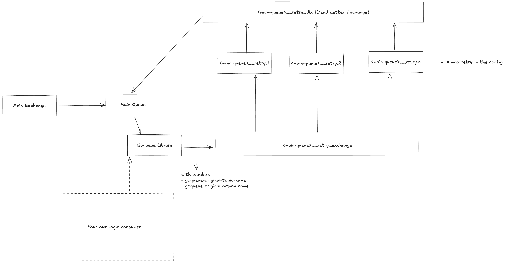

# 🔄 RabbitMQ Retry Architecture in GoQueue

This document explains the sophisticated retry mechanism implemented in GoQueue for RabbitMQ, providing automatic message retry with exponential backoff, dead letter queues, and failure handling.

## 📖 Table of Contents

- [🔄 RabbitMQ Retry Architecture in GoQueue](#-rabbitmq-retry-architecture-in-goqueue)
  - [📖 Table of Contents](#-table-of-contents)
  - [🎯 Overview](#-overview)
  - [🏗️ Architecture Components](#️-architecture-components)
  - [📊 Retry Flow Diagram](#-retry-flow-diagram)
  - [⚙️ How It Works](#️-how-it-works)
  - [🔧 Configuration](#-configuration)
  - [📝 Implementation Details](#-implementation-details)
  - [🎮 Usage Examples](#-usage-examples)
  - [🛠️ Advanced Configuration](#️-advanced-configuration)
  - [📈 Monitoring & Observability](#-monitoring--observability)
  - [💡 Best Practices](#-best-practices)
  - [🔧 Troubleshooting](#-troubleshooting)
  - [⚡ Performance Considerations](#-performance-considerations)
  - [🔮 Future Enhancements](#-future-enhancements)

---

## 🎯 Overview

The RabbitMQ retry mechanism in GoQueue provides:

- **🔄 Automatic Retries** with configurable delay strategies
- **⏰ Time-based Delays** using message TTL and dead letter exchange routing
- **🎯 Dead Letter Queue (DLQ)** for messages that exceed retry limits
- **📊 Retry Tracking** with attempt counting and metadata preservation
- **🛡️ Graceful Degradation** when external services are unavailable

## 🏗️ Architecture Components

### Core Components

1. **Main Queue** - Primary message queue for initial processing
2. **Retry Exchange** - Routes messages to appropriate retry queues
3. **Retry Queues** - Temporary queues with TTL for delayed reprocessing
4. **Dead Letter Exchange (DLX)** - Routes expired retry messages back to main queue
5. **Dead Letter Queue** - Final destination for failed messages

### Queue Topology


---

## 📊 Retry Flow Diagram

Here's the detailed flow of how messages are processed with retry logic:


---

## ⚙️ How It Works



TLDR;

GoQueue will spawn retry queues equal to `MaxRetryFailedMessage` (default: 3) with different TTL configurations for delays. By default, it uses linear delay (1s, 2s, 3s, etc.) but can be configured with exponential backoff (1s, 2s, 4s, 8s) or custom delay functions. Each retry queue is named `{queueName}__retry.{attemptNumber}` and has TTL based on the calculated delay.

### 1. Initial Message Processing

```go
func (r *rabbitMQ) Consume(ctx context.Context, h interfaces.InboundMessageHandler, meta map[string]interface{}) error {
    for {
        select {
        case <-ctx.Done():
            return nil
        case receivedMsg := <-r.msgReceiver:
            // Process message
            msg, err := buildMessage(meta, receivedMsg)
            if err != nil {
                // Handle invalid message format
                receivedMsg.Nack(false, false)
                continue
            }

            // Check retry count
            retryCount := extractHeaderInt(receivedMsg.Headers, headerKey.RetryCount)
            if retryCount > r.option.MaxRetryFailedMessage {
                // Move to dead letter queue
                receivedMsg.Nack(false, false)
                continue
            }

            // Create inbound message with retry capabilities
            inboundMsg := interfaces.InboundMessage{
                Message:    msg,
                RetryCount: retryCount,
                RetryWithDelayFn: r.requeueMessageWithDLQ(meta, msg, receivedMsg),
            }

            // Process with handler
            err = h.HandleMessage(ctx, inboundMsg)
            if err != nil {
                log.Error().Err(err).Msg("Message processing failed")
            }
        }
    }
}
```

### 2. Retry Mechanism

```go
func (r *rabbitMQ) requeueMessageWithDLQ(consumerMeta map[string]interface{}, msg interfaces.Message, receivedMsg amqp.Delivery) func(ctx context.Context, delayFn interfaces.DelayFn) error {
    return func(ctx context.Context, delayFn interfaces.DelayFn) error {
        if delayFn == nil {
            delayFn = interfaces.DefaultDelayFn
        }

        // Increment retry count
        retries := extractHeaderInt(receivedMsg.Headers, headerKey.RetryCount)
        retries++

        // Calculate delay
        delayInSeconds := delayFn(retries)

        // Determine retry queue
        routingKey := getRetryRoutingKey(r.option.QueueName, retries)

        // Prepare headers
        headers := receivedMsg.Headers
        headers[headerKey.OriginalTopicName] = msg.Topic
        headers[headerKey.OriginalActionName] = msg.Action
        headers[headerKey.RetryCount] = retries

        // Publish to retry exchange
        err := r.requeueChannel.PublishWithContext(
            ctx,
            r.retryExchangeName,  // Retry exchange
            routingKey,           // Retry queue routing key
            false,
            false,
            amqp.Publishing{
                Headers:     headers,
                ContentType: receivedMsg.ContentType,
                Body:        receivedMsg.Body,
                Timestamp:   time.Now(),
                AppId:       r.tagName,
                Expiration:  fmt.Sprintf("%d", delayInSeconds*millisecondsMultiplier),
            },
        )

        if err != nil {
            // Fallback: move to DLQ
            return receivedMsg.Nack(false, false)
        }

        // Acknowledge original message
        return receivedMsg.Ack(false)
    }
}
```

### 3. Retry Queue Setup

```go
func (r *rabbitMQ) initRetryModule() {
    // 1. Declare retry exchange
    err := r.consumerChannel.ExchangeDeclare(
        r.retryExchangeName, // exchange name
        "topic",             // exchange type
        true,                // durable
        false,               // auto-delete
        false,               // internal
        false,               // no-wait
        nil,                 // arguments
    )

    // 2. Declare dead letter exchange
    err = r.consumerChannel.ExchangeDeclare(
        r.retryDeadLetterExchangeName, // exchange name
        "fanout",                      // exchange type (fanout for DLX)
        true,                          // durable
        false,                         // auto-delete
        false,                         // internal
        false,                         // no-wait
        nil,                           // arguments
    )

    // 3. Bind main queue to dead letter exchange
    err = r.consumerChannel.QueueBind(
        r.option.QueueName,            // queue name
        "",                            // routing key (empty for fanout)
        r.retryDeadLetterExchangeName, // exchange name
        false,                         // no-wait
        nil,                           // arguments
    )

    // 4. Create retry queues for each retry level
    for i := int64(1); i <= r.option.MaxRetryFailedMessage; i++ {
        retryQueueName := getRetryRoutingKey(r.option.QueueName, i)

        // Declare retry queue with TTL and DLX
        _, err = r.consumerChannel.QueueDeclare(
            retryQueueName, // queue name
            true,           // durable
            false,          // auto-delete
            false,          // exclusive
            false,          // no-wait
            amqp.Table{
                "x-dead-letter-exchange": r.retryDeadLetterExchangeName,
            },
        )

        // Bind retry queue to retry exchange
        err = r.consumerChannel.QueueBind(
            retryQueueName,      // queue name
            retryQueueName,      // routing key (same as queue name)
            r.retryExchangeName, // exchange name
            false,               // no-wait
            nil,                 // arguments
        )
    }
}
```

---

## 🔧 Configuration

### Basic Configuration

```go
consumer := consumer.NewConsumer(
    consumerOpts.ConsumerPlatformRabbitMQ,
    consumerOpts.WithQueueName("user-events"),
    consumerOpts.WithMaxRetryFailedMessage(5), // Maximum 5 retry attempts
    consumerOpts.WithRabbitMQConsumerConfig(
        consumerOpts.RabbitMQConfigWithDefaultTopicFanOutPattern(
            consumerChannel,
            requeueChannel, // Separate channel for retry operations
            "user-exchange",
            []string{"user.created", "user.updated"},
        ),
    ),
)
```

### Retry Strategy Configuration

```go
// Exponential backoff: 1s, 2s, 4s, 8s, 16s...
func exponentialBackoff(retryCount int64) int64 {
    return int64(math.Pow(2, float64(retryCount-1)))
}

// Linear backoff: 1s, 2s, 3s, 4s, 5s...
func linearBackoff(retryCount int64) int64 {
    return retryCount
}

// Custom backoff with jitter
func customBackoffWithJitter(retryCount int64) int64 {
    base := int64(math.Pow(2, float64(retryCount-1)))
    jitter := int64(rand.Intn(1000)) // 0-1000ms jitter
    return base + jitter/1000
}
```

---

## 📝 Implementation Details

### Queue Naming Convention

```go
func getRetryRoutingKey(queueName string, retry int64) string {
    return fmt.Sprintf("%s__retry.%d", queueName, retry)
}

// Examples:
// user-events__retry.1
// user-events__retry.2
// user-events__retry.3
```

### Header Management

```go
const (
    RetryCount         = "x-retry-count"
    OriginalTopicName  = "x-original-topic"
    OriginalActionName = "x-original-action"
    PublishedTimestamp = "x-published-timestamp"
    AppID              = "x-app-id"
)

func extractHeaderInt(headers amqp.Table, key string) int64 {
    val, ok := headers[key]
    if !ok {
        return 0
    }

    var res int64
    _, err := fmt.Sscanf(fmt.Sprintf("%v", val), "%d", &res)
    if err != nil {
        return 0
    }
    return res
}
```

### Message TTL Calculation

```go
const millisecondsMultiplier = 10_000 // Convert to milliseconds

func calculateExpiration(delayInSeconds int64) string {
    return fmt.Sprintf("%d", delayInSeconds*millisecondsMultiplier)
}
```

---

## 🎮 Usage Examples

### Basic Retry Usage

```go
func messageHandler(ctx context.Context, m interfaces.InboundMessage) error {
    // Try to process message
    if err := processBusinessLogic(m.Data); err != nil {
        // Check if error is retryable
        if isTemporaryError(err) {
            // Retry with exponential backoff
            return m.RetryWithDelayFn(ctx, interfaces.ExponentialBackoffDelayFn)
        }

        // Permanent error - move to DLQ
        return m.MoveToDeadLetterQueue(ctx)
    }

    // Success - acknowledge message
    return m.Ack(ctx)
}
```

### Custom Retry Logic

```go
func smartRetryHandler(ctx context.Context, m interfaces.InboundMessage) error {
    err := processMessage(m)
    if err == nil {
        return m.Ack(ctx)
    }

    // Custom retry strategy based on error type
    switch {
    case isNetworkError(err):
        // Quick retry for network issues
        return m.RetryWithDelayFn(ctx, func(retryCount int64) int64 {
            return 1 // 1 second delay
        })

    case isRateLimitError(err):
        // Longer delay for rate limiting
        return m.RetryWithDelayFn(ctx, func(retryCount int64) int64 {
            return 60 // 1 minute delay
        })

    case isDatabaseError(err):
        // Exponential backoff for database issues
        return m.RetryWithDelayFn(ctx, interfaces.ExponentialBackoffDelayFn)

    default:
        // Unknown error - move to DLQ for investigation
        log.Error().
            Err(err).
            Str("message_id", m.ID).
            Msg("Unknown error, moving to DLQ")
        return m.MoveToDeadLetterQueue(ctx)
    }
}
```

### Conditional Retry

```go
func conditionalRetryHandler(ctx context.Context, m interfaces.InboundMessage) error {
    // Check retry count before processing
    if m.RetryCount >= 3 {
        log.Warn().
            Int64("retry_count", m.RetryCount).
            Str("message_id", m.ID).
            Msg("Maximum retries reached, moving to DLQ")
        return m.MoveToDeadLetterQueue(ctx)
    }

    err := processMessage(m)
    if err != nil {
        // Only retry specific error types
        if shouldRetry(err) {
            log.Info().
                Err(err).
                Int64("retry_count", m.RetryCount).
                Str("message_id", m.ID).
                Msg("Retrying message")
            return m.RetryWithDelayFn(ctx, interfaces.ExponentialBackoffDelayFn)
        }

        // Don't retry - move to DLQ
        return m.MoveToDeadLetterQueue(ctx)
    }

    return m.Ack(ctx)
}

func shouldRetry(err error) bool {
    return isTemporaryError(err) || isTimeoutError(err) || isConnectionError(err)
}
```

---

## 🛠️ Advanced Configuration

### Custom Retry Queue Configuration

```go
func customRetrySetup(channel *amqp.Channel, queueName string, maxRetries int64) error {
    retryExchange := fmt.Sprintf("%s__retry_exchange", queueName)
    dlxExchange := fmt.Sprintf("%s__dlx", queueName)

    // Declare exchanges
    if err := channel.ExchangeDeclare(retryExchange, "topic", true, false, false, false, nil); err != nil {
        return err
    }

    if err := channel.ExchangeDeclare(dlxExchange, "fanout", true, false, false, false, nil); err != nil {
        return err
    }

    // Create retry queues with custom TTL
    for i := int64(1); i <= maxRetries; i++ {
        retryQueue := fmt.Sprintf("%s__retry.%d", queueName, i)
        ttl := calculateCustomTTL(i) // Custom TTL calculation

        _, err := channel.QueueDeclare(
            retryQueue,
            true,  // durable
            false, // auto-delete
            false, // exclusive
            false, // no-wait
            amqp.Table{
                "x-dead-letter-exchange": dlxExchange,
                "x-message-ttl":          ttl,
            },
        )
        if err != nil {
            return err
        }

        // Bind to retry exchange
        if err := channel.QueueBind(retryQueue, retryQueue, retryExchange, false, nil); err != nil {
            return err
        }
    }

    return nil
}

func calculateCustomTTL(retryLevel int64) int32 {
    // Custom TTL: 5s, 15s, 45s, 135s, 405s (fibonacci-like)
    multipliers := []int32{5, 15, 45, 135, 405}
    if retryLevel <= int64(len(multipliers)) {
        return multipliers[retryLevel-1] * 1000 // Convert to milliseconds
    }
    return 600000 // 10 minutes for higher retry levels
}
```

### Retry Queue Monitoring

```go
type RetryQueueMonitor struct {
    channel     *amqp.Channel
    queuePrefix string
    maxRetries  int64
}

func (m *RetryQueueMonitor) GetRetryQueueStats() (map[string]int, error) {
    stats := make(map[string]int)

    for i := int64(1); i <= m.maxRetries; i++ {
        queueName := fmt.Sprintf("%s__retry.%d", m.queuePrefix, i)

        queue, err := m.channel.QueueInspect(queueName)
        if err != nil {
            return nil, err
        }

        stats[queueName] = queue.Messages
    }

    return stats, nil
}

func (m *RetryQueueMonitor) DrainRetryQueue(retryLevel int64) error {
    queueName := fmt.Sprintf("%s__retry.%d", m.queuePrefix, retryLevel)

    // Purge the retry queue
    _, err := m.channel.QueuePurge(queueName, false)
    return err
}
```

---

## 📈 Monitoring & Observability

### Metrics Collection

```go
var (
    retriedMessages = prometheus.NewCounterVec(
        prometheus.CounterOpts{
            Name: "goqueue_messages_retried_total",
            Help: "Total number of messages retried",
        },
        []string{"queue", "retry_level"},
    )

    dlqMessages = prometheus.NewCounterVec(
        prometheus.CounterOpts{
            Name: "goqueue_messages_dlq_total",
            Help: "Total number of messages moved to DLQ",
        },
        []string{"queue", "reason"},
    )

    retryDelay = prometheus.NewHistogramVec(
        prometheus.HistogramOpts{
            Name: "goqueue_retry_delay_seconds",
            Help: "Delay before message retry",
        },
        []string{"queue", "retry_level"},
    )
)

func recordRetryMetrics(queueName string, retryLevel int64, delay time.Duration) {
    retriedMessages.WithLabelValues(queueName, fmt.Sprintf("%d", retryLevel)).Inc()
    retryDelay.WithLabelValues(queueName, fmt.Sprintf("%d", retryLevel)).Observe(delay.Seconds())
}
```

### Retry Logging

```go
func retryWithLogging(ctx context.Context, m interfaces.InboundMessage, delayFn interfaces.DelayFn) error {
    delay := delayFn(m.RetryCount + 1)

    log.Info().
        Str("message_id", m.ID).
        Str("topic", m.Topic).
        Str("action", m.Action).
        Int64("retry_count", m.RetryCount).
        Int64("delay_seconds", delay).
        Msg("Retrying message")

    // Record metrics
    recordRetryMetrics("main-queue", m.RetryCount+1, time.Duration(delay)*time.Second)

    return m.RetryWithDelayFn(ctx, delayFn)
}
```

### Dead Letter Queue Monitoring

```go
func monitorDLQ(channel *amqp.Channel, dlqName string) {
    ticker := time.NewTicker(30 * time.Second)
    defer ticker.Stop()

    for range ticker.C {
        queue, err := channel.QueueInspect(dlqName)
        if err != nil {
            log.Error().Err(err).Msg("Failed to inspect DLQ")
            continue
        }

        if queue.Messages > 0 {
            log.Warn().
                Int("message_count", queue.Messages).
                Str("queue", dlqName).
                Msg("Messages in dead letter queue")

            // Send alert
            sendDLQAlert(dlqName, queue.Messages)
        }
    }
}
```

---

## 💡 Best Practices

### 1. **Idempotency**

```go
func idempotentHandler(ctx context.Context, m interfaces.InboundMessage) error {
    // Check if message was already processed
    if wasProcessed(m.ID) {
        log.Info().Str("message_id", m.ID).Msg("Message already processed")
        return m.Ack(ctx)
    }

    // Process message
    if err := processMessage(m); err != nil {
        return m.RetryWithDelayFn(ctx, interfaces.ExponentialBackoffDelayFn)
    }

    // Mark as processed
    markAsProcessed(m.ID)

    return m.Ack(ctx)
}
```

### 2. **Retry Budget**

```go
type RetryBudget struct {
    maxRetriesPerMinute int
    currentRetries      int
    resetTime          time.Time
    mu                 sync.Mutex
}

func (rb *RetryBudget) CanRetry() bool {
    rb.mu.Lock()
    defer rb.mu.Unlock()

    now := time.Now()
    if now.After(rb.resetTime) {
        rb.currentRetries = 0
        rb.resetTime = now.Add(time.Minute)
    }

    if rb.currentRetries >= rb.maxRetriesPerMinute {
        return false
    }

    rb.currentRetries++
    return true
}

func budgetedRetryHandler(ctx context.Context, m interfaces.InboundMessage, budget *RetryBudget) error {
    err := processMessage(m)
    if err != nil {
        if budget.CanRetry() {
            return m.RetryWithDelayFn(ctx, interfaces.ExponentialBackoffDelayFn)
        } else {
            log.Warn().Msg("Retry budget exceeded, moving to DLQ")
            return m.MoveToDeadLetterQueue(ctx)
        }
    }

    return m.Ack(ctx)
}
```

### 3. **Graceful Degradation**

```go
func gracefulRetryHandler(ctx context.Context, m interfaces.InboundMessage) error {
    // Check system health before processing
    if !isSystemHealthy() {
        // System is unhealthy, retry later
        return m.RetryWithDelayFn(ctx, func(retryCount int64) int64 {
            return 60 // Wait 1 minute during system issues
        })
    }

    err := processMessage(m)
    if err != nil {
        if isSystemError(err) {
            // System error - retry with longer delay
            return m.RetryWithDelayFn(ctx, func(retryCount int64) int64 {
                return retryCount * 30 // Longer delays for system errors
            })
        }

        // Business logic error - use normal retry
        return m.RetryWithDelayFn(ctx, interfaces.ExponentialBackoffDelayFn)
    }

    return m.Ack(ctx)
}
```

---

## 🔧 Troubleshooting

### Common Issues

1. **Messages Not Retrying**

   - Check retry exchange and queue bindings
   - Verify TTL configuration
   - Check dead letter exchange setup

2. **Messages Stuck in Retry Queues**

   - Check TTL values
   - Verify dead letter exchange configuration
   - Monitor queue depths

3. **Excessive Retries**
   - Review retry logic
   - Check error classification
   - Monitor retry rates

### Debug Tools

```go
func debugRetrySetup(channel *amqp.Channel, queueName string) error {
    // Check main queue
    mainQueue, err := channel.QueueInspect(queueName)
    if err != nil {
        return err
    }

    log.Info().
        Str("queue", queueName).
        Int("messages", mainQueue.Messages).
        Int("consumers", mainQueue.Consumers).
        Msg("Main queue status")

    // Check retry queues
    for i := 1; i <= 5; i++ {
        retryQueue := fmt.Sprintf("%s__retry.%d", queueName, i)
        queue, err := channel.QueueInspect(retryQueue)
        if err != nil {
            log.Error().Err(err).Str("queue", retryQueue).Msg("Failed to inspect retry queue")
            continue
        }

        log.Info().
            Str("queue", retryQueue).
            Int("messages", queue.Messages).
            Msg("Retry queue status")
    }

    return nil
}
```

---

## ⚡ Performance Considerations

### 1. **Channel Management**

```go
// Use separate channels for retry operations
type ChannelManager struct {
    consumerChannel *amqp.Channel
    retryChannel    *amqp.Channel
    dlqChannel      *amqp.Channel
}

func (cm *ChannelManager) PublishRetry(ctx context.Context, exchange, routingKey string, msg amqp.Publishing) error {
    // Use dedicated retry channel to avoid blocking consumer
    return cm.retryChannel.PublishWithContext(ctx, exchange, routingKey, false, false, msg)
}
```

### 2. **Memory Management**

```go
// Pool message objects to reduce GC pressure
var messagePool = sync.Pool{
    New: func() interface{} {
        return &amqp.Publishing{}
    },
}

func getPooledMessage() *amqp.Publishing {
    return messagePool.Get().(*amqp.Publishing)
}

func putPooledMessage(msg *amqp.Publishing) {
    // Reset message
    *msg = amqp.Publishing{}
    messagePool.Put(msg)
}
```

### 3. **Batch Operations**

```go
func batchRetryOperations(ctx context.Context, retries []RetryRequest) error {
    // Begin transaction
    tx := channel.Tx()
    defer tx.TxRollback()

    for _, retry := range retries {
        if err := publishRetryMessage(ctx, retry); err != nil {
            return err
        }
    }

    // Commit all retry operations
    return tx.TxCommit()
}
```

---

## 🔮 Future Enhancements

### Planned Improvements

1. **Adaptive Retry Delays**

   - Machine learning-based delay calculation
   - System load-aware retry timing
   - Historical success rate optimization

2. **Advanced Dead Letter Handling**

   - Automatic DLQ message replay
   - Message transformation and repair
   - Intelligent error categorization

3. **Cross-Platform Retry**

   - Unified retry interface for all queue platforms
   - Platform-specific optimizations
   - Consistent retry semantics

4. **Enhanced Monitoring**
   - Real-time retry dashboards
   - Predictive failure analysis
   - Automated alerting and remediation

---

The RabbitMQ retry mechanism in GoQueue provides a robust, production-ready solution for handling message failures. By leveraging RabbitMQ's native features like TTL, dead letter exchanges, and message routing, it ensures reliable message processing with minimal complexity and maximum visibility into the retry process.
